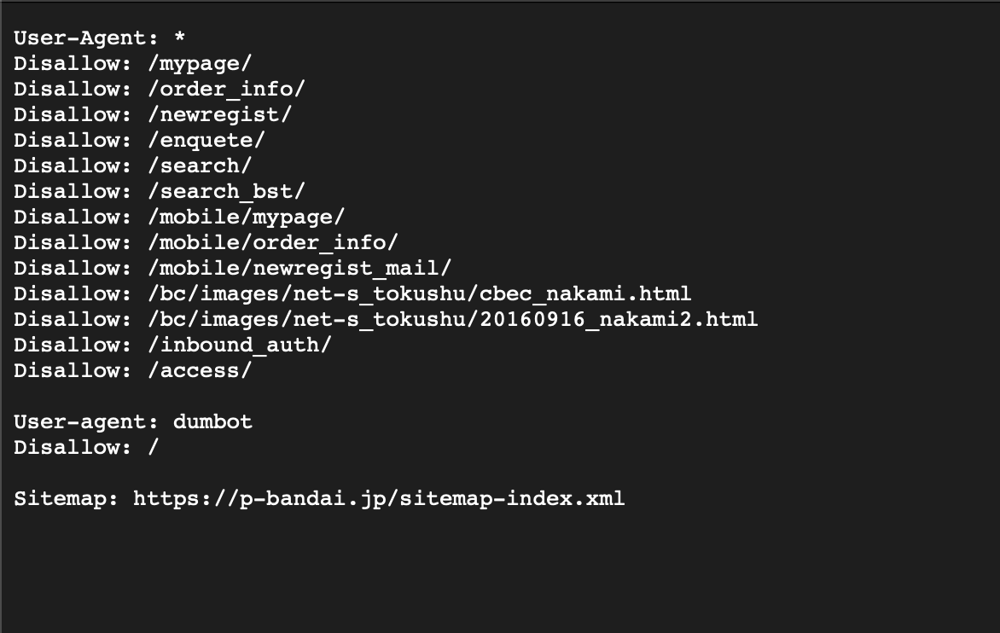

# 学習記録

## 目次
- [2025/12/7](#2025127)
  - [LINEユーザーIDについて](#lineユーザーidについて)
  - [スクレイピングについて](#スクレイピングについて)
  - [ngrokとWebhookについて](#ngrokとwebhookについて)

---

## 2025/12/7

### LINEユーザーIDについて

- 友達全員のユーザーIDを取得するには、認証済みアカウントまたはプレミアムプランへの加入が必要。
　- 上記以外の場合はWebhookで取得する
　  - 今回のプロジェクトではwebhookを使ったプログラムを実装し、ID取得が必要な場合に手動で実行することによりクライアントのI Dを取得する

#### 参考資料
- [LINE Developersドキュメント](https://developers.line.biz/ja/docs/messaging-api/getting-user-ids/)

---

### スクレイピングについて

- **サイトマップ**: Googleにコンテンツを認識させ、SEO対策やクローラー対策として利用される。
  - 例: `https://slo-map.com/sitemap.xml`
- **robots.txt**: クローラー（ロボット）のアクセスを制御するためのファイル。
  - 例: `https://slo-map.com/robots.txt`
- スクレイピングの善悪は、**悪意の有無**と**サーバーへの負荷**が重要な判断基準となる。
- 画像資料
  

#### 岡崎市立中央図書館事件（Librahack事件）

この事件以後、Webスクレイピングに関する大きな事件は特に報告されていないが、重要な教訓を残した。

- **事件の経緯**:
  - 2010年3月: ある男性が、岡崎市立中央図書館の新刊情報を自動取得するプログラム（約1秒に1回のアクセス）を実行。
  - 2010年5月25日: 「偽計業務妨害」の容疑で逮捕。理由は「大量アクセスでシステムを利用不能にした」こと。

- **事件の背景**:
  - 図書館側のシステムに脆弱性があり、通常のアクセスでも高負荷に耐えられない状態だった。
  - 男性に攻撃の意図はなく、個人的な情報収集が目的だった。

- **最終的な結果**:
  - **不起訴処分（起訴猶予）** となり、裁判は行われなかった（無罪判決ではない）。

- **影響と教訓**:
  - この事件は、Webスクレイピングの法的リスクと、サービス提供者側のシステム堅牢性の重要性についての議論を巻き起こした。
  - 悪意がなくとも、過度なアクセスでサーバーに負荷をかける行為は業務妨害と見なされるリスクがある。
  - 一般的に、**1秒に1回程度のアクセス**が、サーバーに配慮したアクセス頻度の一つの目安とされている。

---

### ngrokとWebhookについて（分かりやすい版）

#### ngrokの役割：インターネットへの「魔法のトンネル」

`ngrok`を一言でいうと、「**自分のPCで動いている開発中のプログラムを、一時的にインターネットに公開してくれるトンネル役**」です。

- 普通、自分のPC（ローカル環境）は、セキュリティのために外のインターネットから直接アクセスできません。
- でも、LINEみたいな外部サービスからの通知（Webhook）を受け取るには、インターネット上に公開された住所（URL）が必要になります。
- そこで`ngrok`を起動すると、`https://xxxx.ngrok.io` のような誰でもアクセスできる公開URLが作られ、そこに来た通信をすべて手元のPCに転送してくれます。

このプロジェクトでは、LINEからの「メッセージが届いたよ！」という通知を、開発中のPCで受け取るために使っています。

#### Webhookの仕組み：「電話」より「呼び鈴」

`Webhook`は、例えるなら「**呼び鈴（チャイム）**」のような仕組みです。

- 普通のAPI連携が、こちらから「何か新しい情報ありますか？」と何度も聞きに行く（ポーリングする）「**電話をかける**」スタイルだとすると、
- Webhookは、逆にあちら側から「新しい情報が出たよ！」とこちらの指定したURLに通知しに来てくれる「**呼び鈴を鳴らす**」スタイルです。

**このプロジェクトでの流れ：**

1.  ユーザーがLINEボットにメッセージを送る。
2.  LINEのサーバーが「お、メッセージが来たな」と検知する。
3.  LINEのサーバーが、私たちが予め設定しておいたURL（`ngrok`が作ったURL）に、「こんなメッセージが来たよ」という情報を送ってきます。これが**Webhook**です。
4.  `ngrok`のトンネルを通じて、その情報が私たちのPC上のプログラムに届きます。
5.  プログラムが情報を受け取って、在庫チェックなどの処理を始めます。

この「呼び鈴」の仕組みのおかげで、リアルタイムでユーザーの操作に反応できるわけです。
